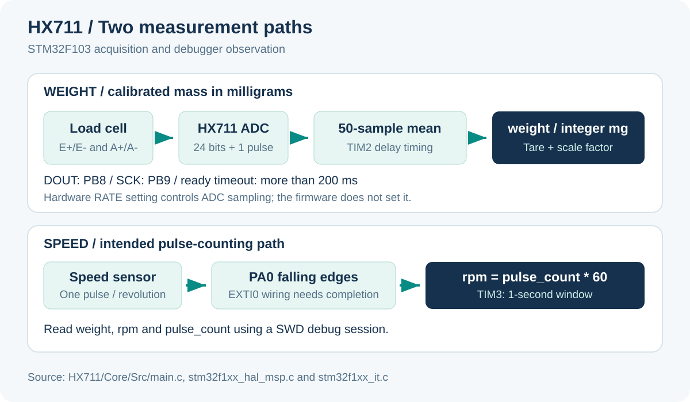

# HX711 Load Cell and RPM Measurement

STM32F103 firmware for reading a load cell through an HX711 ADC, averaging and calibrating mass in milligrams, and estimating shaft speed from sensor pulses. Measurements are exposed as debugger variables.

[English](#english) | [Tiếng Việt](#tieng-viet)



<a id="english"></a>

## Project at a glance

| Item | Implementation |
| --- | --- |
| MCU project | STM32F103C8-class, STM32CubeIDE / STM32 HAL |
| Load-cell interface | GPIO bit-bang on PB8 and PB9 |
| Acquisition | 24 data bits plus one extra clock pulse |
| Weight smoothing | Arithmetic mean of 50 readings |
| Calibration | Tare and reference-mass scale factor |
| Weight output | `weight`, integer milligrams |
| Speed output | `rpm`, floating-point revolutions per minute |
| Display / transport | Debugger watch variables; no UART output in the application |

This is a bench measurement starting point. The repository does not include a complete thrust/torque rig, mechanical drawings, a telemetry application or measured accuracy results.

## Repository map

```text
HX711/
  HX711.ioc                  CubeMX peripheral configuration
  .project / .cproject       STM32CubeIDE project metadata
  Core/Src/main.c            HX711 read, calibration and RPM callbacks
  Core/Src/stm32f1xx_it.c     Interrupt handlers
  Core/Src/stm32f1xx_hal_msp.c Timer clocks and TIM3 NVIC configuration
  Drivers/                   Bundled STM32 HAL and CMSIS
```

Start with [main.c](HX711/Core/Src/main.c), then check the [CubeMX project](HX711/HX711.ioc) and [interrupt handlers](HX711/Core/Src/stm32f1xx_it.c) when adapting hardware.

## Hardware connections

| Function | STM32 pin / peripheral | Notes from the code |
| --- | --- | --- |
| HX711 DOUT / DT | PB8 | GPIO input, no internal pull |
| HX711 SCK | PB9 | Push-pull output |
| Speed sensor output | PA0 | Falling-edge EXTI configuration, no internal pull |
| Microsecond delay | TIM2 | Prescaler 71, period 65535 |
| RPM window | TIM3 | Prescaler 7199, period 9999; interrupt started |
| Programming / observation | SWD debugger | Watch `weight`, `rpm` and raw readings |

Connect the load-cell excitation and differential signal wires to the appropriate HX711 board terminals. Load-cell wire colors vary; determine E+, E-, A+ and A- from the actual sensor documentation.

Use common ground and MCU-compatible signal levels. Check your HX711 breakout's power and logic wiring, and the pulse sensor's output type, before connecting them. The firmware does not configure a RATE pin, so the ADC sampling rate depends on the module's hardware setting.

## Build and inspect

1. Clone:
   ```bash
   git clone https://github.com/TuanLinh05/HX711-Loadcell.git
   cd HX711-Loadcell
   ```
2. Import `HX711/` as an existing project in STM32CubeIDE.
3. Confirm the STM32 target and external oscillator against your board.
4. Review PB8/PB9 wiring and timer clocks; build the project.
5. Program and start a debug session using the matching SWD configuration.
6. Add `weight`, `rpm` and `pulse_count` to Expressions or Live Expressions.
7. Calibrate with an unloaded fixture and a known mass before interpreting the value.

No serial-terminal baud setting is required because this firmware does not initialize a UART or print measurements.

## Load-cell acquisition

`getHX711()` waits for DOUT to go low. If it stays high for more than 200 ms, the function returns zero.

For a ready reading, the firmware:

1. Clocks in 24 bits using TIM2-based delays.
2. Applies `data ^ 0x800000` to shift the raw code representation.
3. Issues one additional clock pulse.
4. Returns the converted raw count.

`weigh()` takes 50 readings, computes their integer mean, then applies the calibration ratio. Startup drives SCK high for 10 ms, then low for 10 ms before acquisition.

At the configured 72 MHz timer clock, TIM2's prescaler creates a 1 MHz counter. Recheck the timer clock if you change the MCU clock tree.

## Calibration and units

Current constants in [main.c](HX711/Core/Src/main.c):

```c
uint32_t tare = 8645755;
float knownOriginal = 74000;  // milligrams: 74 grams
float knownHX711 = 30108;     // reference raw-count change
```

Conceptually:

```text
average_count = mean of 50 converted readings
scale_mg_per_count = knownOriginal / knownHX711
weight_mg = (average_count - tare) * scale_mg_per_count
weight_g = weight_mg / 1000.0
```

To calibrate your fixture:

1. Leave the mounted fixture unloaded and capture the averaged raw value for `tare`.
2. Apply a known reference mass and record its raw-count change relative to tare.
3. Put that count change in `knownHX711` and its mass in milligrams in `knownOriginal`.
4. Keep `knownHX711` nonzero, rebuild and check several masses across the intended range.
5. Confirm sign, repeatability and unloaded return after removing the reference mass.

A debugger breakpoint in `weigh()` can expose `average` without adding a transport layer. Acquisition continues only when execution resumes. The final `weight` variable is integer-valued, so it cannot represent fractional milligrams.

## RPM calculation

The intended path is:

```text
PA0 falling edges -> pulse_count
TIM3 one-second interval -> rpm = pulse_count * 60 -> reset count
```

At a 72 MHz timer clock, the configured TIM3 interval is:

```text
(7199 + 1) * (9999 + 1) / 72000000 = 1 second
```

The equation assumes **one counted pulse per revolution**. For a sensor with N pulses per revolution, the intended RPM conversion is `60 * pulses / N` over a one-second window.

**Bring-up caveat:** PA0 is configured for falling-edge EXTI and the callback increments the counter, but the committed code does not enable `EXTI0_IRQn` or provide an `EXTI0_IRQHandler`. Review the NVIC and handler wiring before expecting the RPM path to receive pulses. TIM3 has its own enabled interrupt and handler.

## Measurement limits and troubleshooting

| Observation | Check |
| --- | --- |
| Large negative or implausible weight | DOUT readiness, timeout returns and calibration constants |
| Weight never settles | Mechanical mounting, supply, load-cell wiring and ADC RATE setting |
| Sign reverses under load | Signal wiring and reference count sign |
| Slow weight refresh | 50-sample averaging and hardware ADC rate |
| RPM stays zero | EXTI0 NVIC / handler, signal edge and sensor wiring |
| RPM is a fixed multiple of reality | Pulses per revolution |

The 200 ms timeout returns zero without a separate error flag. Zero is included in the average, so a disconnected sensor can produce a plausible numeric output with no explicit validity indication. Fifty sequential timeouts can hold the weight loop for roughly ten seconds.

Averaging changes noise and latency; it is not a statement of ADC resolution or measurement accuracy. There is no pulse debouncing, measured speed validation or load-cell performance dataset in this repository.

<a id="tieng-viet"></a>

## Hướng dẫn tiếng Việt

### Mục đích

Firmware STM32F103 đọc loadcell qua HX711, lấy trung bình 50 mẫu rồi quy đổi khối lượng sang **miligam**. Một nhánh khác đếm xung để tính RPM theo cửa sổ một giây.

Kết quả nằm trong biến `weight`, `rpm` và `pulse_count` để theo dõi bằng debugger; chương trình chưa xuất UART hay có giao diện hiển thị riêng.

### Nối dây và chạy thử

1. Nối HX711 DT vào **PB8**, SCK vào **PB9**.
2. Nối đầu ra cảm biến tốc độ vào **PA0**; cấu hình hiện tại đếm **cạnh xuống**.
3. Xác định E+, E-, A+, A- theo tài liệu loadcell, không suy ra từ màu dây.
4. Kiểm tra nguồn, mức logic và GND chung.
5. Import `HX711/` bằng STM32CubeIDE, build và nạp qua SWD.
6. Mở debug, thêm các biến đo vào Expressions hoặc Live Expressions.

### Hiệu chuẩn

- Đọc giá trị trung bình khi không tải để đặt `tare`.
- Đặt vật mẫu đã biết; gán độ tăng raw count vào `knownHX711`.
- Gán khối lượng vật mẫu theo mg vào `knownOriginal`; giá trị hiện tại 74000 mg tương đương 74 g.
- Không đặt `knownHX711 = 0`. Kiểm tra lại bằng nhiều mức tải và khi tháo vật mẫu.
- Muốn đọc theo gram, chia `weight` cho 1000.0.

### Điểm cần kiểm tra

- Nhánh RPM hiện thiếu cấu hình NVIC và handler EXTI0 trong mã đã commit. Cần hoàn thiện đường ngắt trước khi dùng kết quả tốc độ.
- Công thức RPM giả định một xung mỗi vòng; cảm biến nhiều xung cần chia theo số xung/vòng.
- Khi HX711 timeout, hàm trả về 0 và vẫn đưa vào trung bình. Giá trị số lúc đó không đảm bảo là phép đo hợp lệ.
- Tốc độ cập nhật khối lượng phụ thuộc phần cứng HX711 và 50 mẫu trung bình, chưa được đo kiểm trong repo.

## Credits

Created by [Vu Tuan Linh](https://github.com/TuanLinh05), HCMUT. STM32 HAL and CMSIS retain their original notices and component license files. Review those files before redistributing bundled vendor code.
